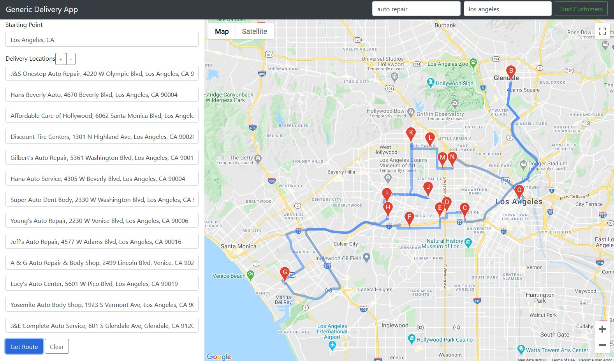

# Get Busy

`Get Busy` is a web application for people who want to plan out the optimal round trip route with multiple stops.

### Technologies Used
* Webpack
* Bootstrap
* jQuery
* Node.js
* Express
* Node Fetch
* HTML5
* CSS3

### Live Demo
Link: https://maps.grantkang.com



## Features

### Current
* User can input the address or name of place for starting location & stops
* User can add/delete the number of stops
* User can choose to prepopulate the locations for the stops by searching for local businesses
* The application will use the user's inputs to plan the optimal round trip course

### Planned
* User can sign up and login to their own accounts
* User can create an address book to save often visited stops
* User can use the addresses in their address book to fill up the form
* User's inputs for stops will dynamically change to relfect the correct order after calculating optimal route
* and much more..

## Getting Started

### Prerequisites
* Node.js 10 or higher
* NPM 6 or higher
* [Google Cloud](https://cloud.google.com) API key with (Maps JavaScript, Places, Directions) APIs enabled
* [Yelp Fusion](https://www.yelp.com/fusion) API key

### Environment Setup
1. Clone the repository
```shell
$ git clone https://github.com/grantkang/get-busy.git
```
2. Once inside the directory, install the dependencies
```shell
$ npm install
```
3. Copy the .env.example file & name it .env
```shell
$ cp .env.example .env
```
4. Include your API keys in the .env file
```javascript
PORT=3000
DEV_SERVER_PORT=3001
GOOGLE_MAP_KEY="<placeholder_key>"
YELP_API_KEY="Bearer <placeholder_key>"
```
5. Include your Google API key in the `src` attribute of the last script element in `server/public/index.html`
```html
 <script src="https://maps.googleapis.com/maps/api/js?key=<GOOGLE_MAP_KEY>&callback=myLib.init" async
  defer></script>
```

6. Run the dev script & visit http://localhost:3000 in your browser
```script
$ npm run dev
```
